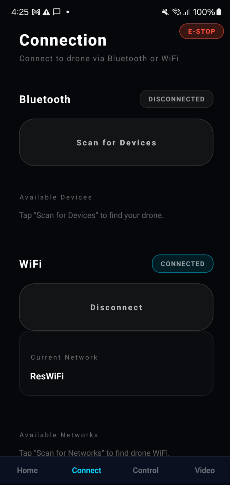
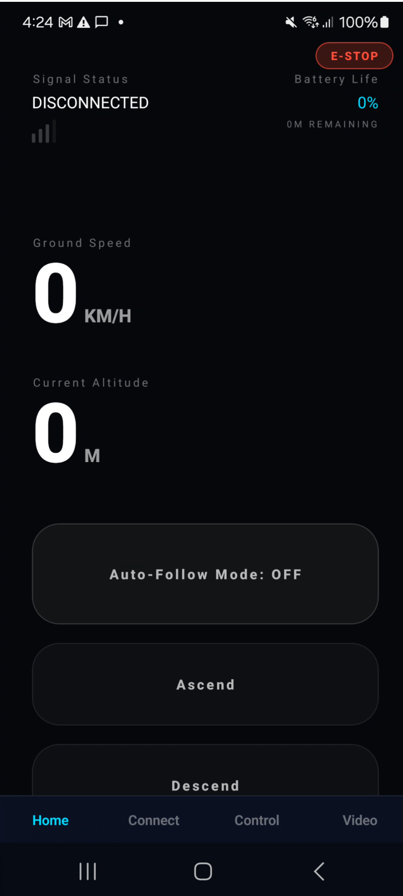
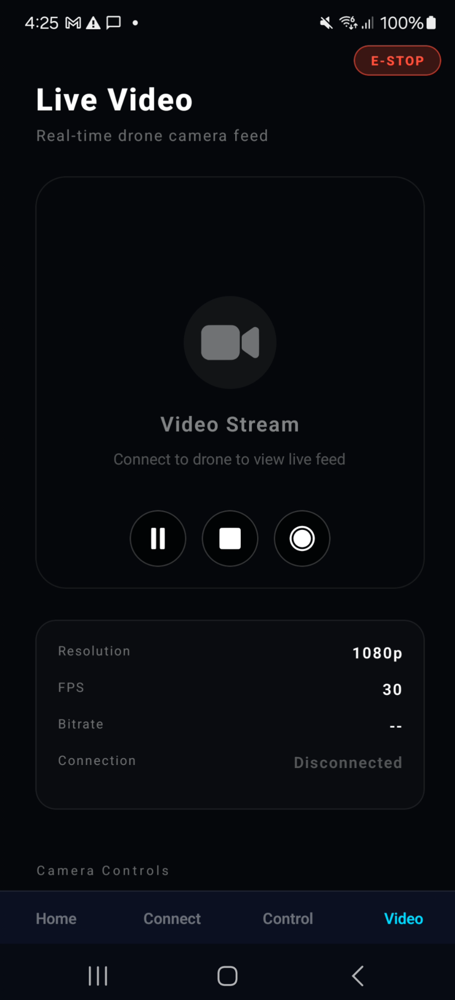
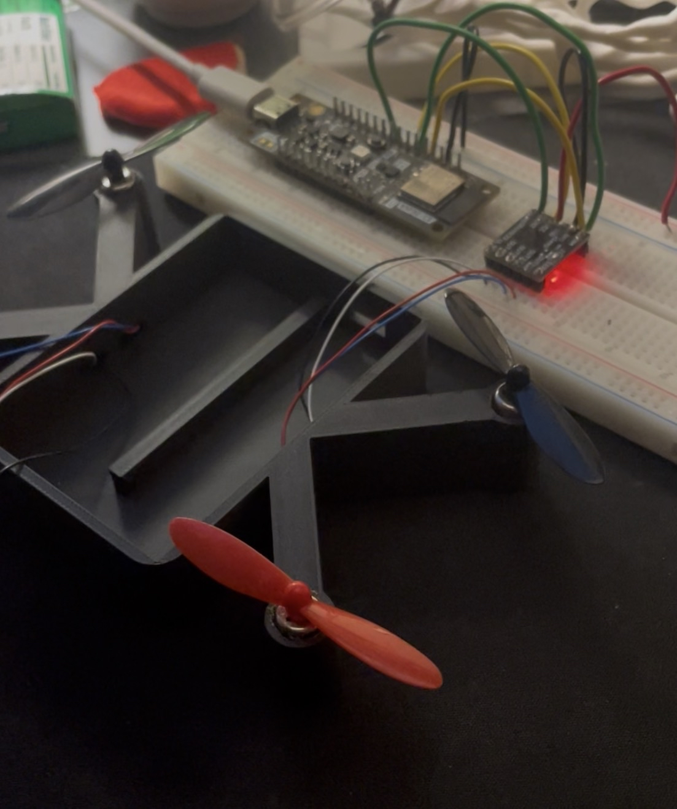
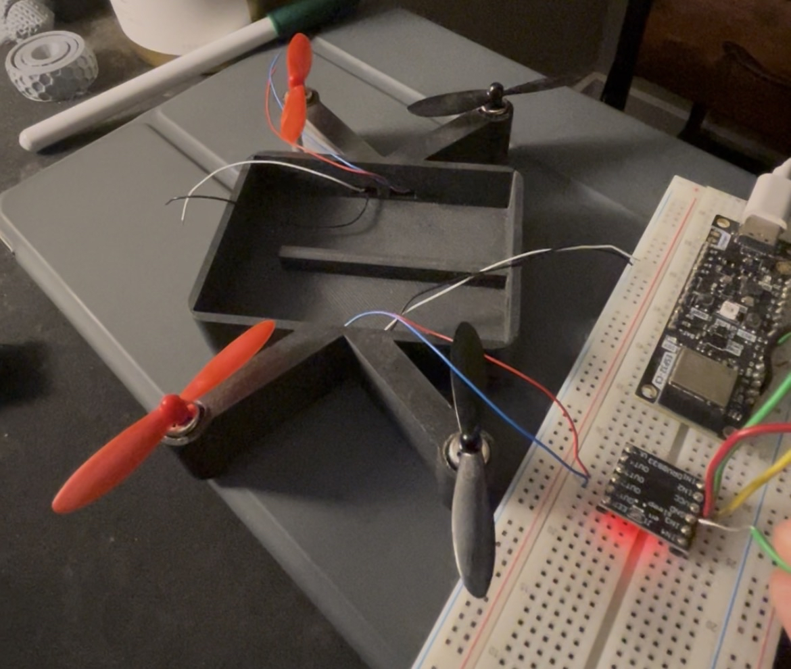

Group 3 Draft Design Document

### Executive Summary {#executive-summary}

### Table of Contents {#table-of-contents}

[Executive Summary](#executive-summary)

[Table of Contents](#table-of-contents)

[Introduction](#introduction)

[Design](#design)

[Evaluation](#evaluation)

[Appendix 1 – Problem Formulation](#appendix-1---problem-formulation)

[Appendix 2 – Planning](#appendix-2---planning)

[Appendix 3 – Test Plan & Results](#appendix-3---test-plan-&-results)

[Appendix 4 – Review](#appendix-4---review)

### Introduction {#introduction}

**Need & Goal Statements**

**Need Statement**

Many independent content creators need dynamic video footage but do not have access to a second person to operate a camera or drone. For example, a travel vlogger walking through a city or a fitness instructor recording an outdoor workout often needs moving shots or aerial perspectives to make their videos more engaging. Current recording setups such as tripods provide only fixed camera angles, while most drones require a dedicated controller and experienced operator. As a result, individuals working alone struggle to capture professional-looking footage. There is a need for a drone system that can be easily controlled by a smartphone, allowing a single user to move the drone and record video simultaneously without requiring additional personnel.

**Goal Statement**

The goal of this project is to design a drone that can be controlled directly from a smartphone using a simple directional interface. When a user presses a direction on the phone, the drone will move in the corresponding direction while capturing video.
Key goals include:
Enabling smartphone-based directional control of the drone.
Allowing users to record video while controlling the drone.
Creating an intuitive control interface that requires minimal training.
Providing a system that allows individual content creators to record themselves without a second operator.

**Personas**

**Persona 1: YouTuber**

Name: Alex

Age: 25

Occupation: YouTube Content Creator

Alex produces travel and lifestyle videos for YouTube and often films alone while visiting new locations. Alex wants to include moving shots and aerial perspectives to make videos more engaging, but using a tripod limits the ability to capture dynamic footage. A smartphone-controlled drone would allow Alex to move the camera while appearing in the video, making it easier to create professional-looking content without needing another person to operate the camera.

**Persona 2: Musician**

Name: Maya

Age: 28

Occupation: Independent Musician

Maya records live performances and music videos for social media platforms. Most recordings are done independently with limited equipment, which restricts camera movement and creative angles. With a drone controlled through a smartphone, Maya could capture overhead shots or move the camera during performances to create more visually engaging music videos.

**Persona 3: Movie Producer**

Name: Daniel

Age: 34

Occupation: Independent Film Producer

Daniel works on small independent film projects with a limited production crew. Capturing aerial or moving shots often requires additional equipment or specialized drone operators, which increases production costs. A smartphone-controlled drone would allow Daniel to capture establishing shots and dynamic camera movement more easily, providing greater flexibility during filming without requiring extra personnel.

**Research into existing designs**

Several existing drone and camera systems provide aerial recording capabilities, but many are not optimized for simple smartphone-based operation by a single individual.

**DJI Mini Series**
The DJI Mini 3 and Mini 4 drones are popular consumer drones that offer high-quality cameras and stable flight systems. These drones are capable of recording high-resolution video and include automated flight modes such as tracking and waypoint navigation. However, DJI drones typically require a dedicated remote controller for reliable operation. While some smartphone control options exist, the systems are designed primarily for users with some experience flying drones. The learning curve and controller hardware may discourage casual users who only need a simple filming solution.

**HoverAir X1**
The HoverAir X1 is a compact drone designed specifically for quick personal recording. It can automatically follow a subject and capture video without requiring manual control. This product is aimed at casual users who want simple aerial footage. While this system simplifies filming, it relies heavily on automated tracking modes rather than manual directional control. Users have limited ability to control precise drone movement or adjust camera position in real time.

**Ryze Tello**
The Ryze Tello drone is a small drone that can be controlled through a smartphone app using Wi-Fi communication. The app includes on-screen controls that allow users to move the drone in different directions. Although Tello demonstrates the feasibility of smartphone-based drone control, it is primarily designed as an educational or beginner drone. The camera quality and control responsiveness are limited compared to higher-end recording systems.

**Sustainability Statement**

The proposed drone system considers sustainability through efficient energy use, reusable components, and minimizing unnecessary hardware.

The drone will operate using rechargeable batteries, allowing repeated use without generating disposable waste. Efficient electronic components and lightweight materials will help reduce power consumption and extend flight time. The design will also emphasize repairability and replaceable components, such as propellers, batteries, and camera modules. This approach extends the lifespan of the device and reduces electronic waste. Additionally, the system uses the user's existing smartphone as the control interface, eliminating the need for a separate controller and reducing additional hardware production.

Through these design considerations, the system aims to provide a functional product while reducing environmental impact and encouraging long-term usability.

### Design {#design}

**Aesthetic Prototype**

**Design for Manufacture, Assembly, Maintenance**

**Block Diagrams**

**Wiring Diagrams**

**State Transition Diagrams**

**Technology**

**Simulations**

### Evaluation {#evaluation}
Our current prototype demonstrates that the core communication and motor control functions for the autonomous drone are functional. The mobile application successfully connects to the ESP32 controller via Bluetooth and enables the selective activation of individual propellers. These results, validated through structured testing, confirm that the basic design architecture is practical and provides a reliable foundation for future development. 

**Functional Prototype**

The functional prototype consists of an ESP32-based flight controller mounted on a quadcopter 3D-printed frame with four brushless motors and propellers powered by a LiPo battery system. The ESP32 serves as the central microcontroller, providing integrated Bluetooth connectivity and sufficient processing capability for current control functions and future autonomy features. Each motor is connected directly to a dedicated PWM-capable GPIO pin on the ESP32, with shared ground connections and separate power rails for logic and motor operation. 

The ESP32 firmware initializes Bluetooth advertising and accepts connections from mobile devices, as verified in our firmware test plan. The mobile application scans for the ESP32, establishes a Bluetooth connection, and provides controls for individual motors. Our testing successfully demonstrated stable Bluetooth connectivity, including device discovery and reliable reconnection across multiple connect/disconnect cycles. 

Photographs of the prototype: 

**App Screenshots**

### Connect Screen

### Home Screen

### Manual Control

### Live Video Feed

## Prototype Photos

**Testing**

Testing focused on verifying end-to-end functionality from mobile app input to physical motor response, following procedures outlined in our test plans. 
1. Bluetooth Connectivity Tests
Executed firmware connectivity tests BLE-01 and BLE-02, confirming the ESP32 advertises correctly and accepts connections within 10 seconds. Completed 5 connect/disconnect cycles with 100 % success rate and no firmware crashes. Mobile app tests BT-01 and BT-02 verified device discovery, connection status updates, and clean disconnection handling.

2. Motor Control Verification
Established a Bluetooth connection and sequentially activated each motor via the app interface. Each selection correctly actuated the corresponding physical motor, confirming proper wiring and command mapping. Response time from app input to motor activation was imperceptible, demonstrating adequate communication latency.

3. Test Plan Implementation
Testing followed two documented plans: a comprehensive system-level plan covering mobile app and drone hardware integration, and a firmware-specific connectivity validation plan. This prototype phase prioritized Bluetooth connectivity and the validation of basic motor control. Subsequent phases will implement the remaining test cases, including flight control, telemetry display, and video streaming.

All executed tests met success criteria, confirming reliable Bluetooth communication between the mobile application and ESP32 controller, and accurate motor actuation from app commands. These results validate the prototype's core functionality and establish a tested foundation for autonomous flight development.

## Appendix 1 – Problem Formulation {#appendix-1---problem-formulation}

### 1. Conceptualisations
**System concept**  

The product is conceived as an **autonomous filming drone**: a quadcopter that captures video without requiring the user to pilot it. The user defines what they want to film (e.g. “follow me”, “orbit this area”, “cover this event”). The drone then flies and films autonomously. Control and monitoring are done via a mobile application over a wireless link. The system is designed so that filming and flying do not depend on drone piloting skills, making it suitable for content creators, sports filming, and event coverage where the focus is on the shot, not on stick control.

**Stakeholders and users**  
- **Content creator / filmmaker.** The primary user is someone who wants to self-document or capture footage without learning to pilot. Examples include solo YouTubers filming themselves (vlogs, activities, tutorials), crews or individuals filming athletes in sports, and event producers using single drones or **larger fleets** to document large events (e.g. sporting events, concerts) from multiple angles.  
- **Development and maintenance.** The team (or future maintainers) who develop and update firmware and the mobile app, and who assemble or repair the hardware.  
- **Subjects and bystanders.** People being filmed or in the operating environment. Safety and predictable autonomous behaviour matter in shared or crowded spaces.

**Main functions (concept level)**  
1. **Communicate.** Reliable two-way link between user and drone (commands, status, telemetry, and video stream).  
2. **Actuate.** Drive the four propellers to achieve lift, orientation, and motion (manual control validated, autonomous flight planned).  
3. **Film.** Capture video (and optionally stream it) for self-documentation, sports, or event coverage.  
4. **Sense.** Perceive the environment and drone state to support autonomous framing, following, and safety.  
5. **Navigate autonomously.** Execute filming behaviours (e.g. follow, orbit, waypoints) and avoid obstacles without manual piloting.  
6. **Scale to fleets.** Support multiple drones documenting one event from several angles, coordinated from a single or small number of operators.

**Context and scenario**  

Use spans **solo creators** (e.g. YouTubers filming themselves), **sports** (filming athletes from the air), and **large events** (sporting events, concerts) where one or many drones provide multi-angle coverage without a pilot per drone. The system is intended for environments where autonomous flight is acceptable and where the value is in hands-free filming rather than manual piloting. This conceptualisation describes what the system is and does at a high level, without committing to low-level implementation details.

---

### 2. Brainstorming

Brainstorming centred on a few key concepts: the drone should not require piloting skill, it should support self-documentation (e.g. solo creators filming themselves), and it should work without internet. Almost every aspect of the system became a "how do we?" question. The team had limited prior experience in drone flight, mobile app development, and sending data between a phone and embedded hardware, so idea generation focused on identifying options and unknowns rather than assuming solutions. The following themes and ideas came out of those discussions.

**1. No piloting skill and self-documentation**
- User chooses a high-level goal (e.g. "follow me", "orbit", "record this") rather than flying manually.
- Preset behaviours (follow, orbit, hover) so the user does not need to learn to pilot.
- Self-documentation as the main use case: one person filming themselves without a second operator.
- Operation that works without internet so it is usable in the field or in places with poor connectivity.

**2. How do we connect the user to the drone and send data?**
- Bluetooth only at first. The team explored BLE for control and pairing with a phone.
- Discovery that BLE alone would not be enough to stream recorded video led to considering alternatives (e.g. WiFi for higher bandwidth when streaming is needed).
- Need to support both control commands and video (or at least video metadata) while keeping "works without internet" in mind.
- Phone app as the primary interface, with only one team member having prior mobile app experience, so app design and communication protocols were open questions.

**3. How do we track the subject or know where to fly?**
- Computer vision on the drone or on the phone to follow a person or target.
- GPS plus magnetometer for position and orientation (outdoor, where GPS is available).
- The team is still unsure which approach to adopt: computer vision vs GPS and magnetometer, or a combination depending on context.

**4. What sensors and parts do we actually need?**
- At first the need for many extra parts was not obvious.
- An IMU was assumed necessary and expected to be available on the ESP32-based board.
- Brainstorming raised the need for a barometer, magnetometer, and possibly a GPS unit.
- Sensors became a major open question: what is strictly necessary for a first version vs what is needed for reliable autonomous behaviour and safety.

---

### 3. Decision Tables

Several important design choices were clarified during the early stages of the project. The following decision tables present these choices in a structured way, focusing on communication methods, camera inclusion, and subject tracking approaches.

#### 1. Communication method for prototype and future streaming

| Criterion                        | BLE only (prototype)             | WiFi only                        | Hybrid BLE + WiFi (future)                | Cellular or long range        |
|----------------------------------|----------------------------------|----------------------------------|-------------------------------------------|------------------------------|
| Supports control commands        | Yes                              | Yes                              | Yes                                       | Yes                          |
| Supports video streaming         | No (not enough bandwidth)        | Yes                              | Yes                                       | Yes                          |
| Works without internet           | Yes                              | Yes                              | Yes                                       | Often needs network backend  |
| Power and complexity             | Low power and simple             | Higher power and more complex    | Higher power and more complex             | Highest complexity           |
| Fit for first prototype          | Chosen for first prototype       | Not used yet                     | Planned for later streaming               | Not planned                  |

**Decision** 

Initially we chose BLE only because it was simple, low power, and enough for basic control. Through brainstorming and early research we concluded that BLE would not be enough for video streaming. For future versions we intend to move toward a hybrid BLE and WiFi approach so that BLE can handle control while WiFi handles higher bandwidth video when needed.

#### 2. Camera inclusion

| Criterion                              | No camera              | Simple fixed camera (chosen)              | Stabilised or advanced camera      |
|----------------------------------------|------------------------|-------------------------------------------|------------------------------------|
| Supports self documentation            | No                     | Yes                                       | Yes                                |
| Hardware and integration complexity    | Lowest                 | Moderate                                  | Highest                            |
| Data bandwidth requirements            | Very low               | Moderate                                  | High                               |
| Matches goal of autonomous filming     | Does not match goal    | Matches goal for first version            | Best match but not required yet    |
| Cost                                   | Lowest                 | Moderate                                  | Highest                            |

**Decision** 
 
We considered leaving the camera out to reduce complexity, cost, and data rate. After discussion we decided that a camera is essential because the main purpose of the system is autonomous filming and self documentation. We therefore treat a simple fixed camera as required for the first version. More advanced camera systems can be added in later iterations.

#### 3. Subject tracking approach (still under evaluation)

| Criterion                             | Computer vision tracking              | GPS plus magnetometer tracking          | Manual framing only                |
|---------------------------------------|---------------------------------------|-----------------------------------------|------------------------------------|
| Works indoors                         | Yes if lighting is good               | No or limited                           | Yes                                |
| Works outdoors                        | Yes                                   | Yes                                     | Yes                                |
| Extra hardware required               | Camera and enough processing          | GPS and magnetometer                    | None beyond basic control          |
| Algorithm and implementation effort   | High                                  | Moderate                                | Low                                |
| Dependence on internet                | Can work offline                      | Works offline                           | Works offline                      |
| Team experience level                 | Limited                               | Limited                                 | Feels most achievable now          |

**Decision**  

We have not finalised a tracking approach yet. Brainstorming focused on two main options, computer vision and GPS with magnetometer. At this stage we expect to start with manual framing and simple behaviours, then introduce tracking using either computer vision, GPS with magnetometer, or a combination once we understand the hardware and software constraints better.

---

### 3. Morphological Charts
To be added soon

### Appendix 2 – Planning {#appendix-2---planning}

#### Basic Plan / Gantt Chart

need to put gantt chart here somehow
---

#### Division of Labor During Prototyping Phase

planning on adding table of who did what

---

#### Collaboration

We used the following tools and processes to coordinate work:

- **Jira** – We used Jira with Kanban boards and Scrum to manage sprints, bugs, and tasks. Epics and stories were broken down into sprint-sized work, and we tracked progress through columns (e.g., To Do, In Progress, In Review, Done). Sprint planning were held regularly at our first meeting of the week.
- **GitHub** – The repository was used for all code, documentation, and design files.
- **Discord** – Discord served as the main channel for day-to-day messaging, quick questions, meeting coordination, and sharing updates between synchronous meetings.

### Appendix 3 – Test Plan & Results {#appendix-3---test-plan-&-results}

**Details**

### Appendix 4 – Review {#appendix-4---review}

**One paragraph from each team member**

