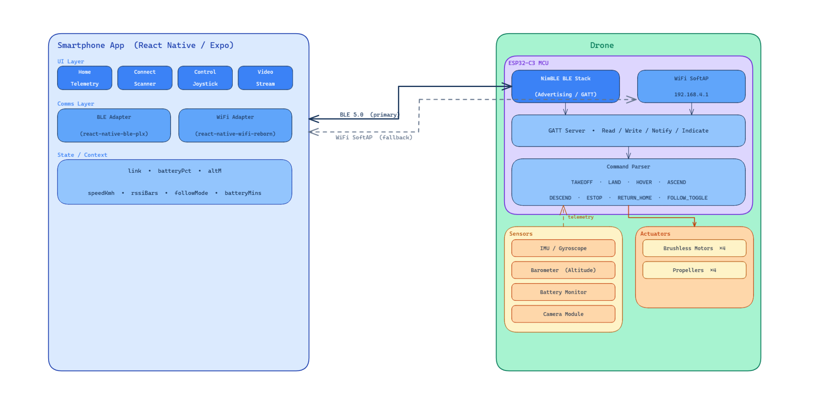
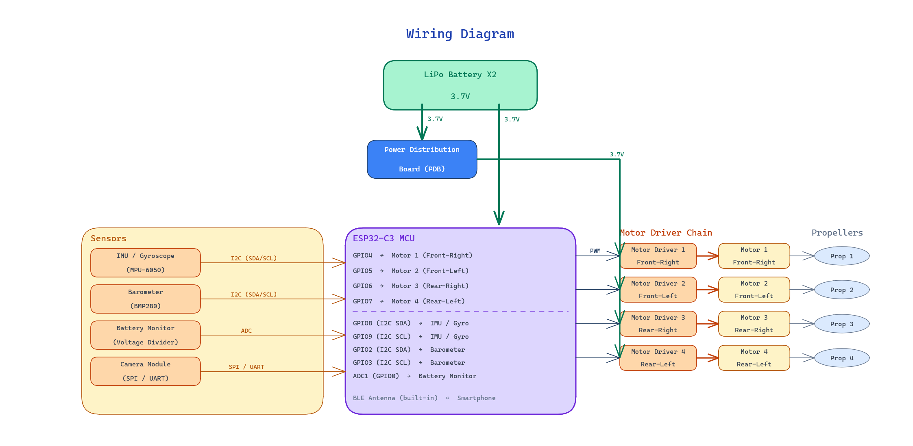

Group 3 Draft Design Document

### Executive Summary {#executive-summary}

### Table of Contents {#table-of-contents}

[Executive Summary](#executive-summary)

[Table of Contents](#table-of-contents)

[Introduction](#introduction)

[Design](#design)

[Evaluation](#evaluation)

[Appendix 1 – Problem Formulation](#appendix-1---problem-formulation)

[Appendix 2 – Planning](#appendix-2---planning)

[Appendix 3 – Test Plan & Results](#appendix-3---test-plan-&-results)

[Appendix 4 – Review](#appendix-4---review)

### Introduction {#introduction}

**Need & Goal Statements**

**Need Statement**

Many independent content creators need dynamic video footage but do not have access to a second person to operate a camera or drone. For example, a travel vlogger walking through a city or a fitness instructor recording an outdoor workout often needs moving shots or aerial perspectives to make their videos more engaging. Current recording setups such as tripods provide only fixed camera angles, while most drones require a dedicated controller and experienced operator. As a result, individuals working alone struggle to capture professional-looking footage. There is a need for a drone system that can be easily controlled by a smartphone, allowing a single user to move the drone and record video simultaneously without requiring additional personnel.

**Goal Statement**

The goal of this project is to design a drone that can be controlled directly from a smartphone using a simple directional interface. When a user presses a direction on the phone, the drone will move in the corresponding direction while capturing video.
Key goals include:
Enabling smartphone-based directional control of the drone.
Allowing users to record video while controlling the drone.
Creating an intuitive control interface that requires minimal training.
Providing a system that allows individual content creators to record themselves without a second operator.

**Personas**

**Persona 1: YouTuber**

Name: Alex

Age: 25

Occupation: YouTube Content Creator

Alex produces travel and lifestyle videos for YouTube and often films alone while visiting new locations. Alex wants to include moving shots and aerial perspectives to make videos more engaging, but using a tripod limits the ability to capture dynamic footage. A smartphone-controlled drone would allow Alex to move the camera while appearing in the video, making it easier to create professional-looking content without needing another person to operate the camera.

**Persona 2: Musician**

Name: Maya

Age: 28

Occupation: Independent Musician

Maya records live performances and music videos for social media platforms. Most recordings are done independently with limited equipment, which restricts camera movement and creative angles. With a drone controlled through a smartphone, Maya could capture overhead shots or move the camera during performances to create more visually engaging music videos.

**Persona 3: Movie Producer**

Name: Daniel

Age: 34

Occupation: Independent Film Producer

Daniel works on small independent film projects with a limited production crew. Capturing aerial or moving shots often requires additional equipment or specialized drone operators, which increases production costs. A smartphone-controlled drone would allow Daniel to capture establishing shots and dynamic camera movement more easily, providing greater flexibility during filming without requiring extra personnel.

**Research into existing designs**

Several existing drone and camera systems provide aerial recording capabilities, but many are not optimized for simple smartphone-based operation by a single individual.

**DJI Mini Series**
The DJI Mini 3 and Mini 4 drones are popular consumer drones that offer high-quality cameras and stable flight systems. These drones are capable of recording high-resolution video and include automated flight modes such as tracking and waypoint navigation. However, DJI drones typically require a dedicated remote controller for reliable operation. While some smartphone control options exist, the systems are designed primarily for users with some experience flying drones. The learning curve and controller hardware may discourage casual users who only need a simple filming solution.

**HoverAir X1**
The HoverAir X1 is a compact drone designed specifically for quick personal recording. It can automatically follow a subject and capture video without requiring manual control. This product is aimed at casual users who want simple aerial footage. While this system simplifies filming, it relies heavily on automated tracking modes rather than manual directional control. Users have limited ability to control precise drone movement or adjust camera position in real time.

**Ryze Tello**
The Ryze Tello drone is a small drone that can be controlled through a smartphone app using Wi-Fi communication. The app includes on-screen controls that allow users to move the drone in different directions. Although Tello demonstrates the feasibility of smartphone-based drone control, it is primarily designed as an educational or beginner drone. The camera quality and control responsiveness are limited compared to higher-end recording systems.

**Sustainability Statement**

The proposed drone system considers sustainability through efficient energy use, reusable components, and minimizing unnecessary hardware.

The drone will operate using rechargeable batteries, allowing repeated use without generating disposable waste. Efficient electronic components and lightweight materials will help reduce power consumption and extend flight time. The design will also emphasize repairability and replaceable components, such as propellers, batteries, and camera modules. This approach extends the lifespan of the device and reduces electronic waste. Additionally, the system uses the user's existing smartphone as the control interface, eliminating the need for a separate controller and reducing additional hardware production.

Through these design considerations, the system aims to provide a functional product while reducing environmental impact and encouraging long-term usability.

### Design {#design}

**Aesthetic Prototype**

**Design for Manufacture, Assembly, Maintenance**
The drone frame is designed with manufacturability and assembly in mind. The structure uses a lightweight 3D-printed frame that can be produced quickly using common additive manufacturing equipment. The design separates the frame into simple components so that damaged parts, such as propeller arms or mounts, can be replaced individually without rebuilding the entire structure. Standard fasteners and mounting holes are used to attach motors, electronics, and the battery to ensure compatibility with commonly available hardware.

Assembly focuses on a modular approach where each subsystem—power, flight control, propulsion, and camera—can be installed independently. This modularity simplifies both initial construction and troubleshooting during development. Wiring is routed through the frame to reduce interference with the propellers and to keep the system organized and accessible.

Maintenance was also considered during the design process. Key components such as the battery, propellers, and microcontroller are easily accessible so they can be replaced or serviced when needed. Because drones experience mechanical stress during flight, the design allows quick replacement of high-wear parts, helping extend the lifespan of the system and reduce downtime during testing or future operation.

**Block Diagrams**

**Wiring Diagrams**

**State Transition Diagrams**

**Technology**

The prototype system is built using an ESP32 microcontroller as the central computing platform. The ESP32 was selected because it integrates wireless communication capabilities, sufficient processing performance, and flexible GPIO interfaces for controlling external hardware. Its built-in Bluetooth functionality enables direct communication with the mobile application without requiring additional wireless modules.

The propulsion system consists of four motors with propellers arranged in a quadcopter configuration. Each motor can be controlled independently, allowing the system to generate lift and directional movement through differential thrust. The drone is powered by a rechargeable lithium-polymer battery that provides a lightweight energy source suitable for aerial applications.

A mobile application serves as the primary user interface. The app manages Bluetooth connections, provides directional controls, and displays system status. This approach leverages the user’s existing smartphone hardware, reducing the need for additional controllers and simplifying the user experience.

**Simulations**

At this stage of development, the focus has been on validating communication and hardware integration through physical prototyping rather than extensive simulation. Initial testing was performed directly on the hardware to verify Bluetooth connectivity and motor activation through the mobile application.

Future development may incorporate simulation tools to model flight dynamics and control algorithms before implementing them on the physical drone. Simulations could allow the team to test autonomous behaviors, sensor integration, and control stability in a controlled virtual environment before deploying those features on the hardware platform. This approach would reduce development risk and improve system reliability as more advanced functionality is added.

### Evaluation {#evaluation}

Our current prototype demonstrates that the core communication and motor control functions for the autonomous drone are functional. The mobile application successfully connects to the ESP32 controller via Bluetooth and enables the selective activation of individual propellers. These results, validated through structured testing, confirm that the basic design architecture is practical and provides a reliable foundation for future development.

**Functional Prototype**

The functional prototype consists of an ESP32-based flight controller mounted on a quadcopter 3D-printed frame with four brushless motors and propellers powered by a LiPo battery system. The ESP32 serves as the central microcontroller, providing integrated Bluetooth connectivity and sufficient processing capability for current control functions and future autonomy features. Each motor is connected directly to a dedicated PWM-capable GPIO pin on the ESP32, with shared ground connections and separate power rails for logic and motor operation.

The ESP32 firmware initializes Bluetooth advertising and accepts connections from mobile devices, as verified in our firmware test plan. The mobile application scans for the ESP32, establishes a Bluetooth connection, and provides controls for individual motors. Our testing successfully demonstrated stable Bluetooth connectivity, including device discovery and reliable reconnection across multiple connect/disconnect cycles.

Photographs of the prototype:

**App Screenshots**

### Connect Screen

### Home Screen

### Manual Control

### Live Video Feed

## Prototype Photos

**Testing**

Testing focused on verifying end-to-end functionality from mobile app input to physical motor response, following procedures outlined in our test plans.

1. Bluetooth Connectivity Tests
   Executed firmware connectivity tests BLE-01 and BLE-02, confirming the ESP32 advertises correctly and accepts connections within 10 seconds. Completed 5 connect/disconnect cycles with 100 % success rate and no firmware crashes. Mobile app tests BT-01 and BT-02 verified device discovery, connection status updates, and clean disconnection handling.

2. Motor Control Verification
   Established a Bluetooth connection and sequentially activated each motor via the app interface. Each selection correctly actuated the corresponding physical motor, confirming proper wiring and command mapping. Response time from app input to motor activation was imperceptible, demonstrating adequate communication latency.

3. Test Plan Implementation
   Testing followed two documented plans: a comprehensive system-level plan covering mobile app and drone hardware integration, and a firmware-specific connectivity validation plan. This prototype phase prioritized Bluetooth connectivity and the validation of basic motor control. Subsequent phases will implement the remaining test cases, including flight control, telemetry display, and video streaming.

All executed tests met success criteria, confirming reliable Bluetooth communication between the mobile application and ESP32 controller, and accurate motor actuation from app commands. These results validate the prototype's core functionality and establish a tested foundation for autonomous flight development.

## Appendix 1 – Problem Formulation {#appendix-1---problem-formulation}

### 1. Conceptualisations

**System concept**

The product is conceived as an **autonomous filming drone**: a quadcopter that captures video without requiring the user to pilot it. The user defines what they want to film (e.g. “follow me”, “orbit this area”, “cover this event”). The drone then flies and films autonomously. Control and monitoring are done via a mobile application over a wireless link. The system is designed so that filming and flying do not depend on drone piloting skills, making it suitable for content creators, sports filming, and event coverage where the focus is on the shot, not on stick control.

**Stakeholders and users**

- **Content creator / filmmaker.** The primary user is someone who wants to self-document or capture footage without learning to pilot. Examples include solo YouTubers filming themselves (vlogs, activities, tutorials), crews or individuals filming athletes in sports, and event producers using single drones or **larger fleets** to document large events (e.g. sporting events, concerts) from multiple angles.
- **Development and maintenance.** The team (or future maintainers) who develop and update firmware and the mobile app, and who assemble or repair the hardware.
- **Subjects and bystanders.** People being filmed or in the operating environment. Safety and predictable autonomous behaviour matter in shared or crowded spaces.

**Main functions (concept level)**

1. **Communicate.** Reliable two-way link between user and drone (commands, status, telemetry, and video stream).
2. **Actuate.** Drive the four propellers to achieve lift, orientation, and motion (manual control validated, autonomous flight planned).
3. **Film.** Capture video (and optionally stream it) for self-documentation, sports, or event coverage.
4. **Sense.** Perceive the environment and drone state to support autonomous framing, following, and safety.
5. **Navigate autonomously.** Execute filming behaviours (e.g. follow, orbit, waypoints) and avoid obstacles without manual piloting.
6. **Scale to fleets.** Support multiple drones documenting one event from several angles, coordinated from a single or small number of operators.

**Context and scenario**

Use spans **solo creators** (e.g. YouTubers filming themselves), **sports** (filming athletes from the air), and **large events** (sporting events, concerts) where one or many drones provide multi-angle coverage without a pilot per drone. The system is intended for environments where autonomous flight is acceptable and where the value is in hands-free filming rather than manual piloting. This conceptualisation describes what the system is and does at a high level, without committing to low-level implementation details.

---

### 2. Brainstorming

Brainstorming centred on a few key concepts: the drone should not require piloting skill, it should support self-documentation (e.g. solo creators filming themselves), and it should work without internet. Almost every aspect of the system became a "how do we?" question. The team had limited prior experience in drone flight, mobile app development, and sending data between a phone and embedded hardware, so idea generation focused on identifying options and unknowns rather than assuming solutions. The following themes and ideas came out of those discussions.

**1. No piloting skill and self-documentation**

- User chooses a high-level goal (e.g. "follow me", "orbit", "record this") rather than flying manually.
- Preset behaviours (follow, orbit, hover) so the user does not need to learn to pilot.
- Self-documentation as the main use case: one person filming themselves without a second operator.
- Operation that works without internet so it is usable in the field or in places with poor connectivity.

**2. How do we connect the user to the drone and send data?**

- Bluetooth only at first. The team explored BLE for control and pairing with a phone.
- Discovery that BLE alone would not be enough to stream recorded video led to considering alternatives (e.g. WiFi for higher bandwidth when streaming is needed).
- Need to support both control commands and video (or at least video metadata) while keeping "works without internet" in mind.
- Phone app as the primary interface, with only one team member having prior mobile app experience, so app design and communication protocols were open questions.

**3. How do we track the subject or know where to fly?**

- Computer vision on the drone or on the phone to follow a person or target.
- GPS plus magnetometer for position and orientation (outdoor, where GPS is available).
- The team is still unsure which approach to adopt: computer vision vs GPS and magnetometer, or a combination depending on context.

**4. What sensors and parts do we actually need?**

- At first the need for many extra parts was not obvious.
- An IMU was assumed necessary and expected to be available on the ESP32-based board.
- Brainstorming raised the need for a barometer, magnetometer, and possibly a GPS unit.
- Sensors became a major open question: what is strictly necessary for a first version vs what is needed for reliable autonomous behaviour and safety.

---

### 3. Decision Tables

Several important design choices were clarified during the early stages of the project. The following decision tables present these choices in a structured way, focusing on communication methods, camera inclusion, and subject tracking approaches.

#### 1. Communication method for prototype and future streaming

| Criterion                 | BLE only (prototype)       | WiFi only                     | Hybrid BLE + WiFi (future)    | Cellular or long range      |
| ------------------------- | -------------------------- | ----------------------------- | ----------------------------- | --------------------------- |
| Supports control commands | Yes                        | Yes                           | Yes                           | Yes                         |
| Supports video streaming  | No (not enough bandwidth)  | Yes                           | Yes                           | Yes                         |
| Works without internet    | Yes                        | Yes                           | Yes                           | Often needs network backend |
| Power and complexity      | Low power and simple       | Higher power and more complex | Higher power and more complex | Highest complexity          |
| Fit for first prototype   | Chosen for first prototype | Not used yet                  | Planned for later streaming   | Not planned                 |

**Decision**

Initially we chose BLE only because it was simple, low power, and enough for basic control. Through brainstorming and early research we concluded that BLE would not be enough for video streaming. For future versions we intend to move toward a hybrid BLE and WiFi approach so that BLE can handle control while WiFi handles higher bandwidth video when needed.

#### 2. Camera inclusion

| Criterion                           | No camera           | Simple fixed camera (chosen)   | Stabilised or advanced camera   |
| ----------------------------------- | ------------------- | ------------------------------ | ------------------------------- |
| Supports self documentation         | No                  | Yes                            | Yes                             |
| Hardware and integration complexity | Lowest              | Moderate                       | Highest                         |
| Data bandwidth requirements         | Very low            | Moderate                       | High                            |
| Matches goal of autonomous filming  | Does not match goal | Matches goal for first version | Best match but not required yet |
| Cost                                | Lowest              | Moderate                       | Highest                         |

**Decision**

We considered leaving the camera out to reduce complexity, cost, and data rate. After discussion we decided that a camera is essential because the main purpose of the system is autonomous filming and self documentation. We therefore treat a simple fixed camera as required for the first version. More advanced camera systems can be added in later iterations.

#### 3. Subject tracking approach (still under evaluation)

| Criterion                           | Computer vision tracking     | GPS plus magnetometer tracking | Manual framing only       |
| ----------------------------------- | ---------------------------- | ------------------------------ | ------------------------- |
| Works indoors                       | Yes if lighting is good      | No or limited                  | Yes                       |
| Works outdoors                      | Yes                          | Yes                            | Yes                       |
| Extra hardware required             | Camera and enough processing | GPS and magnetometer           | None beyond basic control |
| Algorithm and implementation effort | High                         | Moderate                       | Low                       |
| Dependence on internet              | Can work offline             | Works offline                  | Works offline             |
| Team experience level               | Limited                      | Limited                        | Feels most achievable now |

**Decision**

We have not finalised a tracking approach yet. Brainstorming focused on two main options, computer vision and GPS with magnetometer. At this stage we expect to start with manual framing and simple behaviours, then introduce tracking using either computer vision, GPS with magnetometer, or a combination once we understand the hardware and software constraints better.

---

### 3. Morphological Charts

To be added soon

### Appendix 2 – Planning {#appendix-2---planning}

#### Basic Plan / Gantt Chart

#### Division of Labor During Prototyping Phase

The table below summarizes each team member's primary areas of contribution during the prototyping phase. Work was tracked and assigned through Jira across five sprints.

| Team Member | Primary Contributions |
| --- | --- |
| **Ethan Liu** | Worked on mobile app development, including fixing BLE implementation bugs, restructuring the project for expo-router, fixing layout bugs and memory leaks, and setting up WiFi permissions and testing. Also contributed to hardware by 3D-printing the first drone frame. On the documentation side, drafted the systems architecture, set up Jira, created the project wiki, converted the design document to markdown, and researched cloud deployment options. |
| **Cameron Dubois** | Designed the initial Figma mockups for the mobile app and set up the mobile project environment. Implemented Bluetooth connectivity on the mobile side and fixed display issues. |
| **Darin Rahm** | Focused on drone firmware, including testing ESP32 Bluetooth and WiFi connectivity and implementing BLE commands for motor control. Also authored the test plan and created demonstration tests. |
| **Stephen WB** | Worked across firmware and hardware — wrote the motor on/off and speed control functions, and integrated the ESP32 with new hardware components and the camera module. Set up the GitHub repository, created the initial LaTeX documents, and produced the digital system diagrams. |
| **Winnie Wong** | Handled parts research and acquisition, documented component sizes for the final design, and researched campus drone flight guidelines. Designed a custom PCB schematic and created test cases. |
| **Aya Galap** | Designed the updated CAD model for the drone shell and integrated mobile controls with the ESP32 hardware. Continously improving on drone CAD model and releasing new iterations with every change. |

---

#### Collaboration

We used the following tools and processes to coordinate work:

- **Jira** – We used Jira with Kanban boards and Scrum to manage sprints, bugs, and tasks. Epics and stories were broken down into sprint-sized work, and we tracked progress through columns (e.g., To Do, In Progress, In Review, Done). Sprint planning were held regularly at our first meeting of the week.
- **GitHub** – The repository was used for all code, documentation, and design files.
- **Discord** – Discord served as the main channel for day-to-day messaging, quick questions, meeting coordination, and sharing updates between synchronous meetings.

### Appendix 3 – Autonomous Drone – Firmware Connectivity & Command Test Plan & Results

This appendix combines the **Test Plan** (developed prior to testing) and the **Test Report** (data, analysis, and conclusions), in line with standard engineering test documentation.

---

## 1. Scope & Administrative Details

### Scope

- **System under test:** ESP32-C3 firmware for the autonomous drone (BLE stack, WiFi SoftAP, and BLE command layer).
- **Goal of testing:** Validate connectivity, reliability, and the structured BLE command protocol so that the design meets its communication and safety objectives before integration with motors and higher-level flight modes.
- **Parameters and justification:** BLE and WiFi were tested because they are the primary links between the mobile app and the drone; the command layer (ARM/DISARM/ESTOP, motor throttle) was tested because it is the interface on which all future flight logic depends.
- **Expectations (hypothesis):** The ESP32-C3 will advertise over BLE and accept connections within 10 seconds; it will tolerate at least 5 connect/disconnect cycles without failure; the SoftAP will assign an IP via DHCP and remain stable for at least 2 minutes; and the BLE command layer will accept ARM, SET_MOTOR_1, and ESTOP in accordance with the protocol and enforce safety (no motor change when disarmed).

### Administrative Details

- **Date and location of testing:** Winter 2026; room environment (indoor).
- **Client or organization:** CSE123A Engineering Design Project I (UCSC BSOE), Group 3.
- **Conducting the test:** Group 3 project team (firmware and connectivity tests executed by assigned team members).

---

## 2. Test Environment (Apparatus & Design of Experiment)

### Apparatus and Measurement Equipment

| Item | Description / Model |
|------|----------------------|
| Development board | ESP32-C3 development board |
| Host PC | Laptop with USB connection (serial monitor) |
| Mobile device | iPhone 15 Pro, iOS 18.6.2 |
| Serial monitor | ESP-IDF `idf.py monitor` |
| BLE client | nRF Connect for iOS |
| WiFi client | iPhone WiFi settings (built-in) |

### Software and Firmware

- **ESP-IDF:** v5.5-dev-3062-ge9bdd39599
- **Firmware branch:** main
- **Projects tested:** `drone_ble`, `drone_wifi/softAP`

### Test Design (Variables & Sampling)

- **Independent variables:** Connection attempt (BLE/WiFi), command type (ARM, SET_MOTOR_1, ESTOP), arm state (armed vs disarmed).
- **Dependent variables:** Connection success (yes/no), time to connect, reconnect success rate, serial log output (GAP events, DHCP, command ACKs), motor state in serial monitor.
- **Sampling:** Single-factor tests; BLE reconnect test used 5 repeated connect/disconnect cycles (n=5); other tests executed per procedure with results recorded once per run. Raw serial logs and screenshots retained as evidence.
- **Data collection:** Digital (serial log copy-paste, screenshots); written notes for pass/fail and other noteworthy observations.

### Safety Precautions

- No propellers or motor power applied during firmware connectivity and command-layer tests; validation was via serial logs and in-memory state only.
- USB power only for ESP32-C3; no high-current or high-voltage connections during these tests.

### External Factors (Observation)

- Tests conducted indoors. Any observed connection delays or failures are noted in the results.

---

---

## 3. Test Cases (Procedures)

Each test below includes a **step-by-step procedure** to conduct the test, **pass criteria** (expectations), and where applicable **evidence** (data collected). Procedures were followed as written during execution; results are reported in Section 4.

---

### BLE-01 — BLE Scan + Connect

**Purpose:**
Verify that the ESP32 advertises correctly and accepts connections.

**Setup:**
- Flash `drone_ble`
- Reset board
- Open serial monitor

**Steps:**
1. On iPhone, open nRF connect.
2. Scan for BLE devices.
3. Verify device name appears.
4. Connect to device.

**Pass Criteria:**
- Device appears within 10 seconds.
- Connection succeeds within 10 seconds.
- Serial monitor logs show GAP connect event.

**Evidence to Capture:**
#### iPhone Connected View

#### Attribute Table View

### Serial Log Snippet Showing Connection Event.
    - I (23318) NimBLE: connection established; status=0
    - I (23318) NimBLE: handle=1...
    - I (23348) NimBLE:  conn_itvl=24 conn_latency=0 supervision_timeout=72 encrypted=0 authenticated=0 bonded=0

---

### BLE-02 — BLE Reconnect Reliability

**Purpose:**
Verify stability across repeated connect/disconnect cycles.

**Setup:**
- Device powered and advertising.
- Serial monitor open.

**Steps:**
1. Connect to device.
2. Disconnect from iPhone.
3. Reconnect.
4. Repeat 5 times.

**Pass Criteria:**
- At least 5/5 successful reconnect attempts.
- No firmware crashes or resets.
- Advertising resumes after disconnect.

**Results:**
- Attempts: 5
- Success: 5/5
- Advertising resumed after each disconnect: Yes
- Time-to-reconnect: ~instant (<1s, perceived)
- Crashes/resets: None observed
- Disconnect lines:
    - I (8928) NimBLE: disconnect; reason=531
    - I (36668) NimBLE: connection established; status=0
    - these repeated 5 times

---

### WIFI-01 — SoftAP Join + DHCP

**Purpose:**
Verify SoftAP initialization and DHCP functionality.

**Setup:**
- Flash `drone_wifi/softAP`
- Reset board
- Serial monitor open

**Steps:**
1. On iPhone, open WiFi settings.
2. Select SoftAP SSID.
3. Enter password if required.
4. Confirm connection.

**Pass Criteria:**
- Connection succeeds within 15 seconds.
- IP address assigned (192.168.4.x).
- Serial monitor logs show station join event and DHCP started.

**Evidence to Capture:**
- Screenshot of WiFi settings with assigned IP (inside the images folder).
- Serial log:
    - I (492) wifi:mode : softAP (40:4c:ca:89:af:09)
    - I (178902) wifi:station: 5a:a4:48:d9:87:40 join, AID=1
    - I (180112) esp_netif_lwip: DHCP server assigned IP to a client, IP is: 192.168.4.2

**Result**
- Successful
- Notes: Connected <15s, IP 192.168.4.2 assigned, no resets observed.

---

### WIFI-02 — SoftAP Stability (2-Minute Hold)

**Purpose:**
Verify connection stability under idle conditions.

**Setup:**
- Connected to SoftAP via IPhone.

**Steps:**
1. Remain connected for 2 minutes.
2. Observe serial logs for disconnect events.

**Pass Criteria:**
- No unexpected disconnect.
- No firmware reset.
- No DHCP restart events.

**Results:**
- Duration: >2 minutes (observed)
- Unexpected disconnects: None observed
- Firmware resets: None observed
- DHCP restart events: None observed
- Validation method: Successful search `http://192.168.4.1/` after >2 minutes (page returned: "esp32 c3 test alive")

**Serial Logs**
- I (542) esp_netif_lwip: DHCP server started on interface WIFI_AP_DEF with IP: 192.168.4.1
- I (9702) esp_netif_lwip: DHCP server assigned IP to a client, IP is: 192.168.4.2

---

### BLE-03 — Command Layer: ARM / Motor / E-STOP

**Purpose:**
Verify the structured BLE command protocol, ACK behavior, and basic safety rules (ARM required before motor commands, E-STOP zeros all motors).

**Command Packet Format (App → ESP32):**

- Byte 0: `seq` — sequence number (0–255)
- Byte 1: `cmd` — command ID
  - `0x01` = `DRONE_CMD_ARM`
  - `0x02` = `DRONE_CMD_DISARM`
  - `0x03` = `DRONE_CMD_ESTOP`
  - `0x10` = `DRONE_CMD_SET_MOTOR_1`
- Byte 2: `payload_len` — number of payload bytes
- Bytes 3..N: `payload` — command-specific

**ACK Packet Format (ESP32 → App, via Notify):**

- Byte 0: `seq` — copied from command
- Byte 1: `cmd` — copied from command
- Byte 2: `status` — `0x00 = OK`, non‑zero = error
- Bytes 3–6: `drone_ms` — `uint32_t` ms since boot (little-endian)

**Setup:**
- Firmware branch: `ble-command-layer`
- Flash `drone_ble` (this project) with the BLE command layer implemented.
- Open `idf.py monitor` to watch serial logs.
- On iPhone, open **nRF Connect**, connect to `DroneBLE`, and enable **Notify** on the custom characteristic (handle 29 in current logs).

**Steps & Expected Results:**

1. **ARM — `seq=1, cmd=ARM`**
   - Write hex: `01 01 00`
   - Serial:
     - `DRONE_CMD_ARM seq=1`
     - `motor_state armed=1 m1=0 m2=0 m3=0 m4=0`
   - App receives 7-byte ACK with:
     - Byte 0 = `0x01`, Byte 1 = `0x01`, Byte 2 = `0x00` (status OK).

2. **Set Motor 1 Throttle While Armed — `seq=2, cmd=SET_MOTOR_1`**
   - Write hex: `02 10 01 80` (throttle = `0x80` / 128)
   - Serial:
     - `DRONE_CMD_SET_MOTOR (id=0x10) seq=2 throttle=128`
     - `motor_state armed=1 m1=128 m2=0 m3=0 m4=0`
   - ACK status byte remains `0x00`.

3. **Emergency Stop — `seq=3, cmd=ESTOP`**
   - Write hex: `03 03 00`
   - Serial:
     - `DRONE_CMD_ESTOP seq=3`
     - `motor_state armed=0 m1=0 m2=0 m3=0 m4=0`
   - ACK status byte = `0x00`.

4. **Set Motor While Disarmed (Safety Check) — `seq=4, cmd=SET_MOTOR_1`**
   - Write hex: `04 10 01 40`
   - Serial:
     - `SET_MOTOR ignored while disarmed (id=0x10 seq=4)`
   - ACK status byte is **non‑zero** (error).

**Pass Criteria:**

- All four commands produce the expected serial logs above.
- ACKs are received for each write with correct `seq` and `cmd`.
- `SET_MOTOR_1` only changes `m1` when the system is armed (after ARM and before E-STOP/DISARM).
- After E-STOP, all motors stay at 0 even if additional `SET_MOTOR_1` commands are sent.

---

## 4. Data Collected, Summary of Results & Discussion

### Test Report Summary Table

| Objective (Target) | Result | Met? | Discussion |
|--------------------|--------|------|-------------|
| BLE device discoverable within 10 s | Device appeared; connection within 10 s | Yes | ESP32 advertised correctly; GAP connect event logged. |
| BLE connection succeeds within 10 s | Connection succeeded within 10 s | Yes | nRF Connect connected; serial showed connection established. |
| BLE reconnect: ≥5/5 cycles, no crash | 5/5 reconnects; no resets | Yes | Advertising resumed after each disconnect; time-to-reconnect &lt;1 s perceived. |
| SoftAP: client joins, DHCP assigns IP (192.168.4.x) | IP 192.168.4.2 assigned | Yes | Station join and DHCP logs present; connection &lt;15 s. |
| SoftAP: no disconnect for 2 minutes | &gt;2 min connected; no disconnect | Yes | No DHCP restart; http://192.168.4.1/ returned "esp32 c3 test alive" after 2 min. |
| Command ARM: serial and ACK as specified | Correct serial; 7-byte ACK status=0x00 | Yes | motor_state armed=1; ACK seq/cmd/status matched. |
| Command SET_MOTOR_1 while armed: m1 updated | m1=128; ACK OK | Yes | Throttle 0x80 applied when armed. |
| Command ESTOP: all motors zero, armed=0 | m1=m2=m3=m4=0, armed=0 | Yes | ESTOP cleared state; ACK status=0x00. |
| SET_MOTOR while disarmed: ignored, ACK error | Serial "ignored while disarmed"; non-zero status | Yes | Safety rule enforced; no motor change when disarmed. |

### Analysis and Interpretation of Data

All connectivity and command-layer tests met their pass criteria. BLE and WiFi behavior was consistent with the design objectives: the ESP32-C3 is suitable as the communication and command interface for the drone. The BLE command layer correctly enforces arm state and emergency stop. Results are based on serial logs and in-memory state; no physical motor load was applied. Raw data (serial log snippets and screenshots) are included in the test-case sections above.

---

## 5. Known Limitations (Current Phase)

- Command layer currently exposes ARM/DISARM/ESTOP and a single-motor throttle API; high‑level flight modes (ASCEND/DESCEND/FOLLOW_TOGGLE) are not implemented yet.
- No encryption/bonding testing performed.
- No automated latency or packet‑loss measurement implemented yet (timestamp is present in ACKs for future tooling).
- No motor hardware integrated; tests are validated via logs and in‑memory throttle state only.

---

## 6. Ideas for Further Experiments or Experimental Improvement

- Extend the command set to cover high-level flight modes (ASCEND, DESCEND, FOLLOW_TOGGLE).
- Add latency measurement (timestamp + sequence ID) across multiple packets.
- Add packet-loss measurement under noisy or marginal RF conditions.
- Test failure-mode behavior (BLE drop mid-command, app crash, or phone battery loss).

---

## 7. Conclusion(s)

This test plan was developed prior to testing and executed as documented. The test report shows that the ESP32-C3 firmware meets the stated objectives for BLE and WiFi connectivity and for the BLE command layer (ARM, motor throttle, E-STOP). All summary objectives in the table above were met. The results allow anyone to review the plan, design, data, and analysis and reach the same conclusions. This establishes a verified communication and command baseline for the autonomous drone; future motor control and autonomous behaviors will build on this validated transport and command layer and will connect to the mobile-app scenarios defined in the project test plan (e.g., E-STOP, ARM/DISARM flows, and future ASCEND/DESCEND/FOLLOW_TOGGLE behaviors).

### Appendix 4 – Review {#appendix-4---review}

**One paragraph from each team member**
